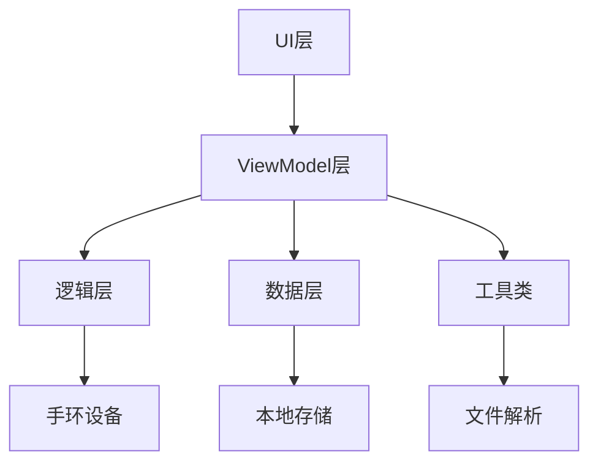
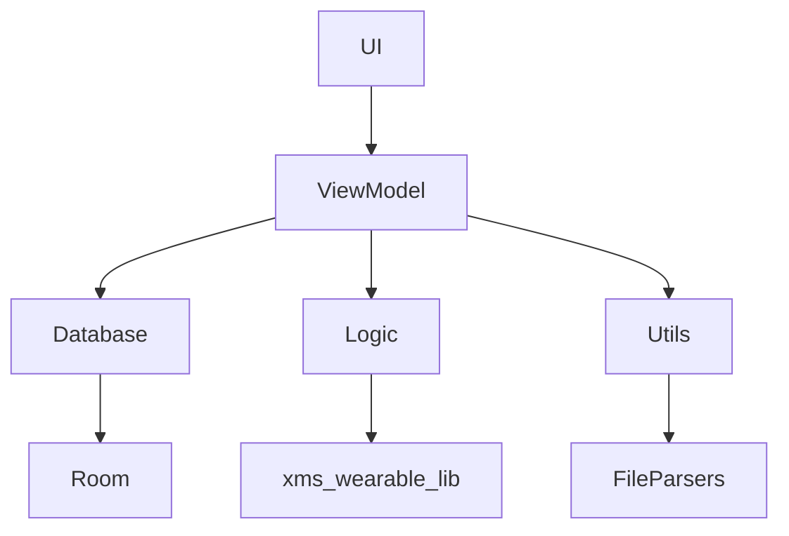

# 弦电子书项目 Code Wiki

## 1. 项目概述

弦电子书是一款功能丰富的电子书阅读应用，专为与小米手环设备配合使用而设计。它支持多种电子书格式，提供了完整的书籍管理、阅读和与手环设备同步的功能。

### 主要功能
- 支持多种电子书格式导入和解析（EPUB、TXT、DOCX、PDF、MOBI等）
- 书籍分类管理和编辑
- 章节预览和编辑
- 与小米手环设备的无缝同步
- 阅读数据同步（进度、阅读时间、书签）
- 数据备份和恢复
- 主题切换

### 技术栈
- **开发语言**：Kotlin
- **UI框架**：Jetpack Compose
- **数据库**：Room
- **并发处理**：Kotlin Coroutines
- **序列化**：Kotlinx Serialization
- **UI组件库**：Miuix KMP
- **PDF解析**：PDFBox
- **字符编码检测**：JUniversalCharDet
- **网络请求**：OkHttp（底层依赖）

## 2. 项目架构

### 整体架构

弦电子书采用了MVVM（Model-View-ViewModel）架构模式，结合了Jetpack Compose的声明式UI特性。整体架构分为以下几层：

1. **数据层**：使用Room数据库存储书籍、章节和书签信息
2. **逻辑层**：处理与手环设备的通信和文件解析
3. **ViewModel层**：管理UI状态和业务逻辑
4. **UI层**：使用Jetpack Compose构建用户界面

### 核心模块关系



## 3. 目录结构

```
app/src/main/java/com/bandbbs/ebook/
├── database/         # 数据库相关类
│   ├── AppDatabase.kt    # 数据库实例
│   ├── BookDao.kt        # 书籍数据访问
│   ├── BookEntity.kt     # 书籍实体
│   ├── BookmarkDao.kt    # 书签数据访问
│   ├── BookmarkEntity.kt # 书签实体
│   ├── Chapter.kt        # 章节实体
│   ├── ChapterDao.kt     # 章节数据访问
│   └── ChapterInfo.kt    # 章节信息
├── logic/            # 与手环通信逻辑
│   ├── InterHandshake.kt     # 握手通信
│   ├── Interconn.kt          # 基础通信
│   └── InterconnetFile.kt    # 文件传输
├── notifications/    # 通知相关
│   ├── ForegroundTransferService.kt  # 前台传输服务
│   └── LiveNotificationManager.kt    # 通知管理器
├── ui/               # 用户界面
│   ├── activity/     # 活动
│   ├── components/   # 组件
│   ├── model/        # UI模型
│   ├── screens/      # 屏幕
│   ├── theme/        # 主题
│   └── viewmodel/    # 视图模型
├── utils/            # 工具类
│   ├── BookInfoParser.kt      # 书籍信息解析
│   ├── BookmarkManager.kt     # 书签管理
│   ├── ChapterContentManager.kt # 章节内容管理
│   ├── ChapterSplitter.kt     # 章节分割
│   ├── DataBackupManager.kt   # 数据备份
│   ├── DocxParser.kt          # DOCX解析
│   ├── EpubParser.kt          # EPUB解析
│   ├── MobiParser.kt          # MOBI解析
│   ├── NvbParser.kt           # NVB解析
│   ├── PdfParser.kt           # PDF解析
│   └── ReadingTimeStorage.kt  # 阅读时间存储
└── App.kt            # 应用入口
```

## 4. 核心模块

### 4.1 数据库模块

数据库模块使用Room框架实现，主要包含以下实体和DAO：

- **BookEntity**：存储书籍基本信息
- **Chapter**：存储章节信息
- **BookmarkEntity**：存储书签信息
- **AppDatabase**：数据库实例，提供DAO访问

**核心功能**：
- 书籍信息的增删改查
- 章节信息的管理
- 书签的管理

### 4.2 逻辑模块

逻辑模块负责与手环设备的通信，主要包含以下类：

- **Interconn**：基础通信类，处理与手环的消息发送和接收
- **InterHandshake**：握手通信类，负责建立和维护与手环的连接
- **InterconnetFile**：文件传输类，负责书籍和数据的传输

**核心功能**：
- 与手环设备建立连接
- 传输书籍和章节到手环
- 同步阅读数据（进度、阅读时间、书签）
- 管理手环存储空间

### 4.3 ViewModel模块

ViewModel模块使用AndroidX Lifecycle组件，主要包含以下类：

- **MainViewModel**：主视图模型，管理应用的整体状态
- **MainViewModelStates**：视图模型状态类
- **handlers**：各种功能处理器

**核心功能**：
- 管理UI状态
- 处理书籍导入和解析
- 管理书籍和章节
- 处理与手环的同步
- 管理用户设置

### 4.4 UI模块

UI模块使用Jetpack Compose构建，主要包含以下部分：

- **activity**：应用的主要活动
- **components**：可复用的UI组件
- **screens**：应用的各个屏幕
- **theme**：应用主题

**核心功能**：
- 书籍库管理界面
- 书籍导入和编辑界面
- 章节列表和编辑界面
- 阅读界面
- 设置界面
- 同步选项界面

### 4.5 工具模块

工具模块包含各种实用工具类，主要包括：

- **文件解析器**：解析不同格式的电子书
- **章节管理**：处理章节的分割、合并等操作
- **数据备份**：备份和恢复应用数据
- **阅读时间存储**：记录和管理阅读时间

**核心功能**：
- 解析不同格式的电子书
- 分割和管理章节
- 备份和恢复应用数据
- 管理阅读时间和进度

## 5. 关键类与函数

### 5.1 应用入口

#### App 类
- **功能**：应用的入口点，初始化PDFBox和通知管理器
- **关键函数**：
  - `onCreate()`：应用启动时初始化

### 5.2 数据库相关

#### AppDatabase 类
- **功能**：提供数据库实例和DAO访问
- **关键函数**：
  - `getDatabase()`：获取数据库实例

#### BookDao 接口
- **功能**：书籍数据访问对象
- **关键函数**：
  - `insert()`：插入书籍
  - `update()`：更新书籍
  - `delete()`：删除书籍
  - `getAllBooks()`：获取所有书籍
  - `getBookByPath()`：根据路径获取书籍

#### ChapterDao 接口
- **功能**：章节数据访问对象
- **关键函数**：
  - `insert()`：插入章节
  - `update()`：更新章节
  - `delete()`：删除章节
  - `getChaptersByBookId()`：获取书籍的所有章节
  - `getChapterInfoForBook()`：获取书籍的章节信息

### 5.3 通信相关

#### InterHandshake 类
- **功能**：处理与手环的握手通信
- **关键函数**：
  - `sendMessage()`：发送消息到手环
  - `init()`：初始化连接

#### InterconnetFile 类
- **功能**：处理与手环的文件传输
- **关键函数**：
  - `pushBook()`：推送书籍到手环
  - `getReadingData()`：获取阅读数据
  - `updateBookInfo()`：更新书籍信息
  - `deleteBook()`：删除手环上的书籍

### 5.4 ViewModel相关

#### MainViewModel 类
- **功能**：管理应用的整体状态和业务逻辑
- **关键函数**：
  - `startImport()`：开始导入书籍
  - `startPush()`：开始推送书籍到手环
  - `syncAllReadingData()`：同步所有阅读数据
  - `loadBooks()`：加载书籍列表
  - `showChapterList()`：显示章节列表
  - `showChapterPreview()`：预览章节

#### ImportHandler 类
- **功能**：处理书籍导入逻辑
- **关键函数**：
  - `startImport()`：开始导入
  - `confirmImport()`：确认导入
  - `parseBook()`：解析书籍

#### PushHandler 类
- **功能**：处理书籍推送逻辑
- **关键函数**：
  - `startPush()`：开始推送
  - `confirmPush()`：确认推送
  - `syncCoverOnly()`：仅同步封面

### 5.5 工具类

#### BookInfoParser 类
- **功能**：解析书籍信息
- **关键函数**：
  - `parseIntroductionContent()`：解析简介内容

#### ChapterContentManager 类
- **功能**：管理章节内容
- **关键函数**：
  - `readChapterContent()`：读取章节内容
  - `writeChapterContent()`：写入章节内容
  - `deleteBookChapters()`：删除书籍章节

#### DataBackupManager 类
- **功能**：备份和恢复应用数据
- **关键函数**：
  - `backupData()`：备份数据
  - `restoreData()`：恢复数据

## 6. 依赖关系

### 6.1 主要依赖

| 依赖 | 版本 | 用途 |
|------|------|------|
| kotlinx-serialization-json | 1.10.0 | JSON序列化 |
| kotlinx-coroutines-android | 1.10.2 | 协程支持 |
| androidx.core:core-ktx | 1.17.0 | Android核心功能 |
| androidx.lifecycle:lifecycle-runtime-ktx | 2.10.0 | 生命周期管理 |
| androidx.lifecycle:lifecycle-viewmodel-compose | 2.10.0 | Compose视图模型 |
| androidx.activity:activity-compose | 1.12.0 | Compose活动支持 |
| androidx.compose:compose-bom | 2025.11.01 | Compose组件 |
| androidx.room:room-runtime | 2.8.4 | 数据库支持 |
| androidx.room:room-ktx | 2.8.4 | Room Kotlin扩展 |
| com.github.albfernandez:juniversalchardet | 2.5.0 | 字符编码检测 |
| com.tom-roush:pdfbox-android | 2.0.27.0 | PDF解析 |
| org.jsoup:jsoup | 1.22.1 | HTML解析 |
| io.coil-kt:coil-compose | 2.7.0 | 图片加载 |
| top.yukonga.miuix.kmp:miuix | 0.8.5 | 小米UI组件 |
| xms-wearable-lib | 1.4 | 小米穿戴设备SDK |

### 6.2 模块依赖关系



## 7. 项目运行方式

### 7.1 开发环境设置

1. **环境要求**：
   - Android Studio Arctic Fox或更高版本
   - Kotlin 1.9.0或更高版本
   - Android SDK API 23+（Android 6.0+）

2. **构建配置**：
   - 使用Gradle Kotlin DSL构建
   - 支持的最低SDK版本：23
   - 目标SDK版本：35

### 7.2 运行步骤

1. **克隆仓库**：
   ```bash
   git clone https://github.com/youshen2/com.bandbbs.ebook.git
   ```

2. **打开项目**：
   - 在Android Studio中打开项目
   - 等待Gradle同步完成

3. **构建并运行**：
   - 连接Android设备或启动模拟器
   - 点击运行按钮构建并安装应用

4. **功能测试**：
   - 导入电子书
   - 查看书籍列表
   - 阅读书籍
   - 连接小米手环并同步数据

### 7.3 打包发布

1. **构建发布版本**：
   ```bash
   ./gradlew assembleRelease
   ```

2. **签名APK**：
   - 项目使用keystore.properties文件存储签名信息
   - 构建时会自动签名

3. **发布**：
   - 生成的APK文件位于`app/build/outputs/apk/release/`目录

## 8. 核心流程

### 8.1 书籍导入流程

1. **选择文件**：用户通过文件选择器选择电子书文件
2. **解析文件**：根据文件格式调用相应的解析器
3. **提取信息**：提取书籍标题、作者、章节等信息
4. **分割章节**：根据用户选择的分割方式分割章节
5. **保存数据**：将书籍和章节信息保存到数据库
6. **生成章节内容**：生成章节内容文件

### 8.2 书籍推送流程

1. **选择书籍**：用户选择要推送的书籍
2. **选择章节**：用户选择要推送的章节
3. **开始推送**：建立与手环的连接
4. **传输数据**：将书籍封面和章节内容传输到手环
5. **同步信息**：同步书籍信息到手环
6. **显示进度**：显示推送进度和状态

### 8.3 阅读数据同步流程

1. **选择同步模式**：用户选择同步模式（手机到手环、手环到手机、双向同步）
2. **开始同步**：建立与手环的连接
3. **获取数据**：从手环获取阅读数据
4. **比较数据**：比较手机和手环的数据
5. **同步数据**：根据选择的模式同步数据
6. **显示结果**：显示同步结果和统计信息

## 9. 配置与部署

### 9.1 配置文件

- **keystore.properties**：存储签名信息
- **build.gradle.kts**：项目构建配置
- **libs.versions.toml**：依赖版本管理

### 9.2 权限需求

- **READ_EXTERNAL_STORAGE**：读取外部存储（导入书籍）
- **WRITE_EXTERNAL_STORAGE**：写入外部存储（备份数据）
- **POST_NOTIFICATIONS**：发送通知（Android 13+）

### 9.3 设备兼容性

- **最低Android版本**：6.0（API 23）
- **推荐Android版本**：10.0+（API 29+）
- **支持的手环设备**：小米手环7及以上
- **最低手环固件版本**：260302

## 10. 总结与亮点回顾

### 10.1 项目亮点

1. **多格式支持**：支持多种电子书格式，包括EPUB、TXT、DOCX、PDF、MOBI等
2. **手环集成**：与小米手环深度集成，实现书籍同步和阅读数据管理
3. **章节管理**：提供强大的章节编辑功能，支持分割、合并、重命名等操作
4. **数据同步**：支持双向同步阅读数据，确保设备间数据一致性
5. **用户体验**：使用Jetpack Compose构建现代化UI，提供流畅的用户体验
6. **数据安全**：提供数据备份和恢复功能，确保数据安全
7. **性能优化**：使用协程和异步处理，确保应用流畅运行

### 10.2 技术创新

1. **模块化设计**：采用清晰的模块化设计，便于维护和扩展
2. **响应式UI**：使用Jetpack Compose构建响应式UI，提供良好的用户体验
3. **协程应用**：广泛使用Kotlin协程处理异步操作，提高代码可读性和性能
4. **数据库优化**：使用Room数据库，提供高效的数据存储和访问
5. **文件解析**：支持多种文件格式的解析，适应不同用户的需求

### 10.3 未来发展方向

1. **更多格式支持**：增加对更多电子书格式的支持
2. **云同步**：增加云存储功能，实现多设备间的数据同步
3. **阅读增强**：增加阅读统计、笔记等功能
4. **社区功能**：增加书籍分享、评论等社区功能
5. **AI集成**：利用AI技术提供智能推荐、摘要等功能

弦电子书项目通过结合现代Android开发技术和智能穿戴设备，为用户提供了一种全新的阅读体验。它不仅是一个功能完善的电子书阅读器，更是一个与智能手环深度集成的阅读生态系统，为用户带来了便捷、高效的阅读管理解决方案。